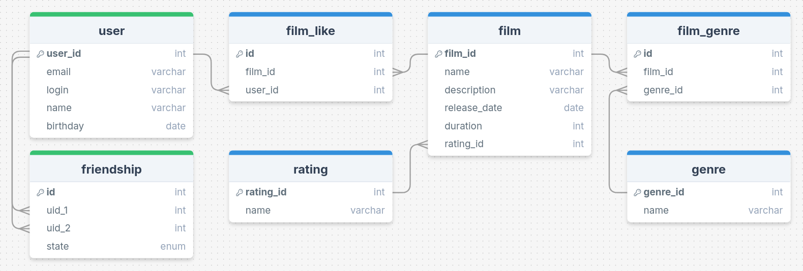

# java-filmorate


Бэкенд-приложение для сервиса, который работает с каталогом фильмов и оценками пользователей.

## Содержание
- [Модели](#модели)
- [Валидация](#валидация)
- [REST-контроллеры](#rest-контроллеры)
- [База данных](#база-данных)
    - [ER-диаграмма](#er-диаграмма)
    - [Таблицы](#таблицы)
    - [SQL-запросы](#sql-запросы)

## Модели

### `Film`

- `id` - целочисленный идентификатор
- `name` - название
- `description` - описание
- `releaseDate` - дата релиза
- `duration` - продолжительность фильма
- `rating` - рейтинг фильма по [MPAA](https://ru.wikipedia.org/wiki/Система_рейтингов_Американской_киноассоциации)

### `User`

- `id` - целочисленный идентификатор
- `email` - электронная почта
- `login` - логин пользователя
- `name` - имя для отображения
- `birthday` - дата рождения

## Валидация

При обновлении фильма или пользователя **обязательно** только поле `id`, остальные поля **опциональны**.

### `Film`

- `name` - название не может быть пустым
- `description` - максимальная длина описания 200 символов
- `releaseDate` - дата релиза не раньше 28 декабря 1895 года (день рождения кинематографа)
- `duration` - продолжительность фильма должна быть положительным числом

### `User`

- `email` - электронная почта не может быть пустой и должна содержать символ `@`
- `login` - логин не может быть пустым и содержать пробелы
- `name` - имя для отображения может быть пустым — в таком случае будет использован логин
- `birthday` - дата рождения не может быть в будущем


## REST-контроллеры

### `FilmController`

#### `/films`

- `POST` `/films` - добавление фильма
- `PUT` `/films` - обновление фильма
- `GET` `/films` - получение всех фильмов

- `PUT` `/films/{id}/like/{userId}` - пользователь ставит лайк фильму
- `DELETE` `/films/{id}/like/{userId}` - пользователь удаляет лайк

- `GET` `/films/popular?count={count}` - возвращает список из первых `count` фильмов по количеству лайков. Если значение параметра `count` не задано, возвращает первые 10.

### `UserController`

#### `/users`

- `POST` `/users` - создание пользователя
- `PUT` `/users` - обновление пользователя
- `GET` `/users` - получение списка всех пользователей

- `PUT` `/users/{id}/friends/{friendId}` - добавление в друзья
- `DELETE` `/users/{id}/friends/{friendId}` - удаление из друзей
- `GET` `/users/{id}/friends` - возвращаем список пользователей, являющихся его друзьями
- `GET` `/users/{id}/friends/common/{otherId}` - список друзей, общих с другим пользователем

## База данных

### ER-диаграмма


### Таблицы

Таблицы базы данных соответствуют третьей нормальной форме - `3NF`

#### `film`

Содержит информацию о фильмах.

- первичный ключ `film_id` - идентификатор фильма
- `name` - название фильма
- `description` - описание фильма
- `releaseDate` - дата релиза фильма
- `duration` - продолжительность фильма
- внешний ключ `rating_id` (отсылает к таблице `rating`) - идентификатор рейтинга фильма

#### `film_genre`

Таблица отношений между фильмами и жанрами

- первичный ключ `id` - идентификатор
- внешний ключ `film_id` (отсылает к таблице `film`) - идентификатор фильма
- внешний ключ `genre_id` (отсылает к таблице `genre`) - идентификатор жанра

#### `film_like`

Содержит информацию о понравившихся фильмах.

- первичный ключ `id` - идентификатор
- внешний ключ `film_id` (отсылает к таблице `film`) - идентификатор фильма
- внешний ключ `user_id` (отсылает к таблице `user`) - идентификатор пользователя

#### `friendship`

Содержит информацию о дружбе пользователей.

**Правило при добавлении**: `uid_1` < `uid_2`

- первичный ключ `id` - идентификатор
- внешний ключ `uid_1` (отсылает к таблице `user`) - идентификатор первого пользователя
- внешний ключ`uid_2` (отсылает к таблице `user`) - идентификатор второго пользователя
- `state` - статус дружбы, может быть:
    - `REQ_UID1` - пользователь `uid_1` запросил дружбу c пользователем `uid_2`
    - `REQ_UID2` - пользователь `uid_2` запросил дружбу с пользователем `uid_1`
    - `FRIEND` - пользователи стали друзьями

#### `genre`

Содержит информацию о жанрах кино

- первичный ключ `genre_id` - идентификатор жанра
- `name` наименование жанра

#### `rating`

Содержит информацию о рейтингах

- первичный ключ `rating_id` - идентификатор рейтинга
- `name` - наименование рейтинга. Значения могут быть следующими:
    - G - у фильма нет возрастных ограничений
    - PG - детям рекомендуется смотреть фильм с родителями
    - PG-13 - детям до 13 лет просмотр не желателен
    - R - лицам до 17 лет просматривать фильм можно только в присутствии взрослого
    - NC-17 - лицам до 18 лет просмотр запрещён

#### `user`

Содержит информацию о пользователях.

- первичный ключ `user_id` - идентификатор пользователя
- `email` - электронная почта пользователя
- `login` - логин пользователя
- `name` - имя пользователя
- `birthday` - дата рождения пользователя

### SQL-запросы

#### `/films`

- `POST` `/films` - добавление фильма
- `PUT` `/films` - обновление фильма
- `GET` `/films` - получение всех фильмов
  ```sql
  SELECT f.film_id,
      f.name,
      f.description,
      f.duration,
      f.release_date,
      r.name AS rating_name
  FROM film AS f
  INNER JOIN rating AS r
      ON f.rating_id = r.rating_id;
  ```

- `PUT` `/films/{id}/like/{userId}` - пользователь ставит лайк фильму
- `DELETE` `/films/{id}/like/{userId}` - пользователь удаляет лайк

- `GET` `/films/popular?count={count}` - возвращает список из первых `count` фильмов по количеству лайков. Если значение параметра `count` не задано, возвращает первые 10.
  ```sql
  -- @count - переменная с заданным максимальным количеством элементов списка 
  
  -- Реализация с применением JOIN
  SELECT f.film_id,
      f.name,
      f.description,
      f.duration,
      f.release_date,
      r.name AS rating_name
  FROM film AS f
  INNER JOIN rating AS r
      ON f.rating_id = r.rating_id
  INNER JOIN film_like AS fl
      ON f.film_id = fl.film_id
  GROUP BY fl.film_id
  ORDER BY COUNT(fl.user_id) DESC
  LIMIT @count;
  
  -- Реализация с применением подзапроса
  SELECT f.film_id,
      f.name,
      f.description,
      f.duration,
      f.release_date,
      r.name AS rating_name
  FROM film AS f,
      rating AS r
  WHERE f.rating_id = r.rating_id
      AND film_id IN (
          SELECT film_id
          FROM film_like
          GROUP BY film_id
          ORDER BY COUNT(user_id) DESC
          LIMIT @count
      );
  ```

- Получение всех жанров фильма
  ```sql
  -- @id - переменная с идентификатором фильма
  
  -- Реализация с применением JOIN
  SELECT g.name
  FROM genre AS g
  INNER JOIN film_genre AS fg
      ON fg.film_id = @id 
      AND fg.genre_id = g.genre_id;
  
  -- Реализация с применением подзапроса
  SELECT g.name
  FROM genre AS g
  WHERE g.genre_id IN (
      SELECT fg.genre_id
      FROM film_genre AS fg
      WHERE fg.film_id = @id
  );
  ```
#### `/users`

- `POST` `/users` - создание пользователя
- `PUT` `/users` - обновление пользователя
- `GET` `/users` - получение списка всех пользователей
  ```sql
  SELECT *
  FROM user;
  ```

- `PUT` `/users/{id}/friends/{friendId}` - добавление в друзья
- `DELETE` `/users/{id}/friends/{friendId}` - удаление из друзей
- `GET` `/users/{id}/friends` - возвращаем список пользователей, являющихся его друзьями
  ```sql
  -- @id - переменная с идентификатором пользователя
  
  SELECT *
  FROM user 
  WHERE user_id IN (
      SELECT uid_2
      FROM friendship
      WHERE uid_1 = @id
          AND state = 'FRIEND'
          
      UNION
          
      SELECT uid_1
      FROM friendship
      WHERE uid_2 = @id
          AND state = 'FRIEND'
  );
  ```
- `GET` `/users/{id}/friends/common/{otherId}` - список друзей, общих с другим пользователем
  ```sql
  -- @uid_1 - переменная с идентификатором первого пользователя
  -- @uid_2 - переменная с идентификатором второго пользователя
      
  SELECT *
  FROM user
  WHERE user_id IN (
      SELECT *
      FROM (
          SELECT uid_1 AS all_id
          FROM friendship
          WHERE uid_2 IN (@uid_1, @uid_2) 
              AND uid_1 NOT IN (@uid_1, @uid_2) 
              AND state = 'FRIEND'
          
          UNION ALL
          
          SELECT uid_2
          FROM friendship
          WHERE uid_1 IN (@uid_1, @uid_2) 
              AND uid_2 NOT IN (@uid_1, @uid_2) 
              AND state = 'FRIEND'
      )
      GROUP BY all_id
      HAVING COUNT(all_id) = 2
  );
  ```
