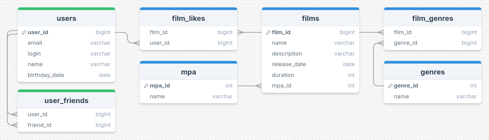

# java-filmorate

Бэкенд-приложение для сервиса, который работает с каталогом фильмов и оценками пользователей.

## Содержание
- [Модели](#модели)
- [Валидация](#валидация)
- [REST-контроллеры](#rest-контроллеры)
- [База данных](#база-данных)
    - [ER-диаграмма](#er-диаграмма)
    - [Таблицы](#таблицы)

## Модели

### `Film`

- `id` - целочисленный идентификатор
- `name` - название
- `description` - описание
- `releaseDate` - дата релиза
- `duration` - продолжительность фильма
- `mpa` - рейтинг фильма по [MPAA](https://ru.wikipedia.org/wiki/Система_рейтингов_Американской_киноассоциации)

### `User`

- `id` - целочисленный идентификатор
- `email` - электронная почта
- `login` - логин пользователя
- `name` - имя для отображения
- `birthday` - дата рождения

### `Mpa`

- `id` - целочисленный идентификатор
- `name` - наименование рейтинга

### `Genre`

- `id` - целочисленный идентификатор
- `name` - наименование жанра

## Валидация

При обновлении фильма или пользователя **обязательно** только поле `id`, остальные поля **опциональны**.

### `Film`

- `name` - название не может быть пустым
- `description` - максимальная длина описания 200 символов
- `releaseDate` - дата релиза не раньше 28 декабря 1895 года (день рождения кинематографа)
- `duration` - продолжительность фильма должна быть положительным числом

### `User`

- `email` - электронная почта не может быть пустой и должна содержать символ `@`
- `login` - логин не может быть пустым и содержать пробелы
- `name` - имя для отображения может быть пустым — в таком случае будет использован логин
- `birthday` - дата рождения не может быть в будущем

## REST-контроллеры

### `FilmController`

- `POST` `/films` - добавление фильма
- `PUT` `/films` - обновление фильма
- `GET` `/films` - получение всех фильмов

- `PUT` `/films/{id}/like/{userId}` - пользователь ставит лайк фильму
- `DELETE` `/films/{id}/like/{userId}` - пользователь удаляет лайк

- `GET` `/films/popular?count={count}` - возвращает список из первых `count` фильмов по количеству лайков. Если значение параметра `count` не задано, возвращает первые 10.

### `UserController`

- `POST` `/users` - создание пользователя
- `PUT` `/users` - обновление пользователя
- `GET` `/users` - получение списка всех пользователей

- `PUT` `/users/{id}/friends/{friendId}` - добавление в друзья
- `DELETE` `/users/{id}/friends/{friendId}` - удаление из друзей
- `GET` `/users/{id}/friends` - возвращаем список пользователей, являющихся его друзьями
- `GET` `/users/{id}/friends/common/{otherId}` - список друзей, общих с другим пользователем

### `GenreController`

- `GET` `/genres` - получение списка всех жанров

- `GET` `/genres/{id}` - возвращает жанр по идентификатору

### `MpaController`

- `GET` `/mpa` - получение списка всех рейтингов

- `GET` `/mpa/{id}` - возвращает рейтинг по идентификатору

## База данных

### ER-диаграмма

### Таблицы

Таблицы базы данных соответствуют третьей нормальной форме - `3NF`

#### Таблица `films`

Содержит информацию о фильмах.

- первичный ключ `film_id` - идентификатор фильма
- `name` - название фильма
- `description` - описание фильма
- `release_date` - дата релиза фильма
- `duration` - продолжительность фильма
- внешний ключ `mpa_id` (отсылает к таблице `mpa`) - идентификатор рейтинга фильма

#### Таблица `film_genres`

Таблица отношений между фильмами и жанрами

- составной первичный ключ `(film_id, genre_id)` 
- внешний ключ `film_id` (отсылает к таблице `films`) - идентификатор фильма
- внешний ключ `genre_id` (отсылает к таблице `genres`) - идентификатор жанра

#### Таблица `film_likes`

Содержит информацию о понравившихся фильмах.

- составной первичный ключ `(film_id, user_id)`
- внешний ключ `film_id` (отсылает к таблице `films`) - идентификатор фильма
- внешний ключ `user_id` (отсылает к таблице `users`) - идентификатор пользователя

#### Таблица `user_friends`

Содержит информацию о дружбе пользователей.

- составной первичный ключ `(user_id, friend_id)`
- внешний ключ `user_id` (отсылает к таблице `users`) - идентификатор пользователя
- внешний ключ`friend_id` (отсылает к таблице `users`) - идентификатор пользователя (друга)

#### Таблица `genres`

Содержит информацию о жанрах кино

- первичный ключ `genre_id` - идентификатор жанра
- `name` наименование жанра

#### Таблица `mpa`

Содержит информацию о рейтингах

- первичный ключ `mpa_id` - идентификатор рейтинга
- `name` - наименование рейтинга. Значения могут быть следующими:
    - G - у фильма нет возрастных ограничений
    - PG - детям рекомендуется смотреть фильм с родителями
    - PG-13 - детям до 13 лет просмотр не желателен
    - R - лицам до 17 лет просматривать фильм можно только в присутствии взрослого
    - NC-17 - лицам до 18 лет просмотр запрещён

#### Таблица `users`

Содержит информацию о пользователях.

- первичный ключ `user_id` - идентификатор пользователя
- `email` - электронная почта пользователя
- `login` - логин пользователя
- `name` - имя пользователя
- `birthday_date` - дата рождения пользователя